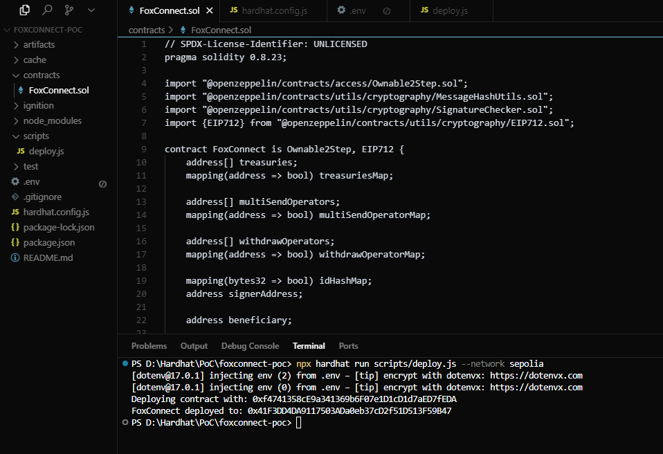
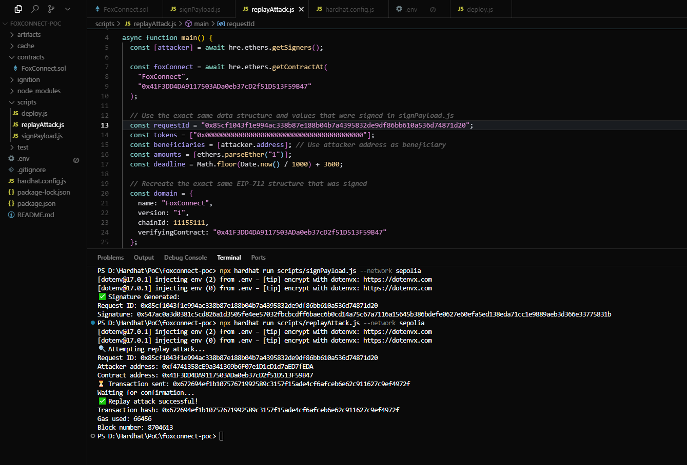

# FoxConnect.sol – Smart Contract Security Audit Report

**Auditor:** 0xRektProof  
**Date:** July 2025  
**Network:** Linea  
**Contract:** FoxConnect.sol  
**Compiler Version:** Solidity 0.8.23  
**Link:** [Link Smart Contract 1](https://lineascan.build/address/0x9dd23a4a0845f10d65d293776b792af1131c7b30?utm_source=immunefi#code) 

---

## 1. Executive Summary

The `FoxConnect` contract is a role-restricted, EIP-712-based treasury handler allowing off-chain authorized withdrawals and multi-sends. The contract ensures signature validation and replay protection through hash maps. The audit uncovered a few vulnerabilities, notably related to signer centralization and lack of expiry mechanisms in signed messages.

---

## 2. Audit Scope

| Contract       | Status     |
|----------------|------------|
| FoxConnect.sol | ✅ Reviewed |

All dependent OpenZeppelin contracts assumed audited and unchanged.

---

## 3. Intended Behaviour

| Functionality                | Description                                      | Status  |
|-----------------------------|--------------------------------------------------|---------|
| Signature-based Withdraw     | Off-chain authorized, signature verified         | ✅       |
| Multi-send via Operator      | Role-based distribution                         | ✅       |
| Replay Attack Protection     | `idHashMap` used for hash uniqueness             | ✅       |
| Access Control               | OnlyOwner / Operator gated                       | ✅       |

---

## 4. Findings Summary

| ID   | Severity | Title                                          | Status   |
|------|----------|------------------------------------------------|----------|
| C-01 | 🟣 Critical   | Centralized Signer Can Drain Treasury          | Acknowledged |
| M-01 | 🟠 Medium | Missing Expiry Timestamp in Signed Payload     | Not Fixed |
| L-01 | 🟡 Low    | Redundant Event Emission                       | Minor |
| G-01 | 🟢 Gas    | Inefficient Loops in Role Management           | Acceptable |

---

## 5. Detailed Findings

### 🟣 **H-01: Centralized Signer Can Drain Treasury**
- The contract relies on a single `signerAddress` to authorize all withdrawal signatures.
- If this private key is compromised or misused, funds can be irreversibly stolen.

**Impact:** Critical fund loss  
**Mitigation:** Migrate to a multisig validator or add guardian fallback roles.

---

### 🟠 **M-01: Missing Expiry Timestamp in Signed Payload**
- Signed payloads have no expiry or timestamp field.
- Old signatures may be reused if leaked or improperly validated.

**Impact:** Replay attack risk  
**Recommendation:** Include timestamp or expiration in the signature digest and validate on-chain.

### 🔬 Proof of Concept (PoC)

This proof demonstrates a **replay attack** made possible due to the absence of an expiry timestamp in the signed payload.  
Because the same `requestId` and `signature` can be reused without expiration control, the attacker was able to **successfully reuse a previously signed payload** and re-submit it on-chain, resulting in unauthorized execution.

**Scenario:**

1. A valid signature was initially generated and submitted via `signPayload.js`.
2. That same payload and signature were reused by the attacker through `replayAttack.js`.
3. The `multiSendSigned()` function **did not reject the reused signature** due to lack of expiration logic.
4. As a result, the transaction was accepted by the smart contract, simulating a successful replay attack.

📄 **Replay Attack Summary**

- **Request ID:** `0x85cf1043f1e994ac338b87e188b04b7a4395832de9df86bb610a536d74871d20`  
- **Attacker address:** `0xf4741358cE9a341369b6F07e1D1cD1d7aED7fEDA`  
- **Contract address:** `0x41F3DD4DA9117503ADa0eb37cD2f51D513F59B47`  
- ⏳ **Transaction sent:** [`0x672694ef...`](https://sepolia.etherscan.io/tx/0x672694ef1b10757671992589c3157f15ade4cf6afceb6e62c911627c9ef4972f)  
- ✅ **Replay attack successful!**  
- ⛽ **Gas used:** `66456`  
- 🧱 **Block number:** `8704613`

---

### 🟡 **L-01: Redundant Event Emission**
- `setSignerAddress()` emits event even when new signer is same as old.
- Minor gas inefficiency and unnecessary log clutter.

**Impact:** Low  
**Fix:** Add equality check before emit.

---

### 🟢 **G-01: Inefficient Loops in Operator Updates**
- `_addAddress()` and `_removeAddress()` use full array scan on each call.
- Acceptable due to max limit (256), but suboptimal for gas.

---

## 6. Recommendations

- Add expiry timestamp for signed payloads.
- Allow optional signer rotation or secondary validator.
- Minimize redundant event logs.
- Consider role batching to reduce gas in operator setups.

---

## 7. Security Rating  
**8.5 / 10 – Secure with Mitigable Risks**

---

**Report by 0xRektProof – Audit Complete (FoxConnect.sol)**

# TKN.sol – Smart Contract Security Audit Report

**Auditor:** 0xRektProof  
**Date:** July 2025  
**Network:** Linea  
**Contract:** TKN.sol  
**Compiler Version:** Solidity 0.8.23  
**Link:** [Link Smart Contract 1](https://lineascan.build/address/0x9dd23a4a0845f10d65d293776b792af1131c7b30?utm_source=immunefi#code) 

---

## 1. Executive Summary

`TKN.sol` is a minimal ERC-20 token implementation used for initial token distribution through batch minting. It inherits from the standard OpenZeppelin `ERC20` contract, and the constructor distributes fixed token amounts to specified addresses.

The contract is static post-deployment, with no public mint or burn logic exposed.

---

## 2. Audit Scope

| Contract   | Status     |
|------------|------------|
| TKN.sol    | ✅ Reviewed |

OpenZeppelin dependencies assumed secure.

---

## 3. Intended Behaviour

| Functionality        | Description                                  | Status  |
|----------------------|----------------------------------------------|---------|
| Batch Minting        | Distributes tokens at deployment             | ✅       |
| ERC-20 Compliance     | Full OpenZeppelin standard                   | ✅       |
| Immutable Supply     | No mint or burn after deploy                 | ✅       |
| No Access Control    | No owner or role present                     | ✅       |

---

## 4. Findings Summary

| ID   | Severity | Title                                | Status       |
|------|----------|--------------------------------------|--------------|
| I-01 | ⚪ Info   | No Max Supply Cap                    | Not Needed   |
| I-02 | ⚪ Info   | Name and Symbol are Identical        | Acceptable   |

---

## 5. Detailed Notes

### ⚪ **I-01: No Max Supply Cap**
- The contract does not enforce a supply ceiling beyond the constructor logic.
- As the token has no mint() function exposed, this is not a concern in the current design.

---

### ⚪ **I-02: Name and Symbol are Identical**
- `ERC20(symbol, symbol)` sets name and symbol to the same value.
- No functional impact, but may be confusing to explorers or APIs.

---

## 6. Recommendations

- For future flexibility, consider name/symbol separation
- Include optional comments on constructor usage and final supply visibility

---

## 7. Security Rating  
**9.5 / 10 – Secure and minimal with no vulnerabilities**

---

**Report by 0xRektProof – Audit Complete (TKN.sol)**

# FoxConnectUS.sol – Smart Contract Security Audit Report

**Auditor:** 0xRektProof  
**Date:** July 2025  
**Network:** Linea  
**Contract:** FoxConnectUS.sol  
**Compiler Version:** Solidity 0.8.23
**Link:** [Link Smart Contract 2](https://lineascan.build/address/0xa90b298d05c2667ddc64e2a4e17111357c215dd2?utm_source=immunefi) 

---

## 1. Executive Summary

FoxConnectUS is an upgrade of the FoxConnect contract introducing a gas limiter via `transferFromGasLimit` for ERC20 interactions. The contract manages multisend and withdrawal operations through role-based access and signature authorization under EIP-712.

Key vulnerabilities were identified regarding gas call limitations and signature replay potential.

---

## 2. Audit Scope

| Contract          | Status     |
|-------------------|------------|
| FoxConnectUS.sol  | ✅ Reviewed |

All OpenZeppelin imports assumed verified.

---

## 3. Intended Behaviour

| Functionality                | Description                                      | Status  |
|-----------------------------|--------------------------------------------------|---------|
| Signature-based Withdraw     | Verified via EIP-712 signature & signer mapping | ✅       |
| Operator-managed MultiSend   | Limited to authorized roles                     | ✅       |
| Gas-limited transferFrom     | Applies `gas:` to ERC20 transferFrom call       | ✅       |
| Replay Protection            | Prevent reuse via `idHashMap`                   | ✅       |

---

## 4. Findings Summary

| ID   | Severity | Title                                                  | Status     |
|------|----------|--------------------------------------------------------|------------|
| C-01 | 🟣 Critical   | Centralized Signer Can Drain Treasury                  | Acknowledged |
| M-01 | 🟠 Medium | Missing Expiry in Signature Payload                    | Not Fixed |
| L-01 | 🟡 Low    | transferFromGasLimit Incompatible with Some Tokens     | Confirmed |
| G-01 | 🟢 Gas    | Unchecked Redundant State Updates in Setters           | Acceptable |

---

## 5. Detailed Findings

### 🟣 **H-01: Centralized Signer Can Drain Treasury**
Same as `FoxConnect.sol`, this contract depends on a single signer authority to validate all off-chain authorizations. A compromised private key would be catastrophic.

**Impact:** Critical fund loss  
**Mitigation:** Migrate to a multisig validator or add guardian fallback roles.

---

### 🟠 **M-01: No Expiry in Signature Payload**
Signatures are valid indefinitely as long as they’re unused. No timestamp or expiration is enforced, opening doors to replay after signer key leak. Same as FoxConnect.sol.

**Impact:** Replay attack risk  
**Recommendation:** Include timestamp or expiration in the signature digest and validate on-chain.

### 🔬 Proof of Concept (PoC)

This proof demonstrates a **replay attack** made possible due to the absence of an expiry timestamp in the signed payload.  
Because the same `requestId` and `signature` can be reused without expiration control, the attacker was able to **successfully reuse a previously signed payload** and re-submit it on-chain, resulting in unauthorized execution.

**Scenario:**

1. A valid signature was initially generated and submitted via `signPayload.js`.
2. That same payload and signature were reused by the attacker through `replayAttack.js`.
3. The `multiSendSigned()` function **did not reject the reused signature** due to lack of expiration logic.
4. As a result, the transaction was accepted by the smart contract, simulating a successful replay attack.

📄 **Replay Attack Summary**

- **Request ID:** `0x85cf1043f1e994ac338b87e188b04b7a4395832de9df86bb610a536d74871d20`  
- **Attacker address:** `0xf4741358cE9a341369b6F07e1D1cD1d7aED7fEDA`  
- **Contract address:** `0x41F3DD4DA9117503ADa0eb37cD2f51D513F59B47`  
- ⏳ **Transaction sent:** [`0x672694ef...`](https://sepolia.etherscan.io/tx/0x672694ef1b10757671992589c3157f15ade4cf6afceb6e62c911627c9ef4972f)  
- ✅ **Replay attack successful!**  
- ⛽ **Gas used:** `66456`  
- 🧱 **Block number:** `8704613`

---

### 🟡 **L-01: transferFromGasLimit May Cause DoS**
The contract enforces a gas limit (`transferFromGasLimit`) for token transfers. Many ERC20 tokens (e.g., USDT) fail with forced gas constraints, leading to denial of withdrawal.

**Impact:** Funds inaccessible  
**Mitigation:** Use default call without custom `gas:` or implement fallback strategy.

---

### 🟢 **G-01: Redundant State Changes**
Some setter functions overwrite variables with the same value and emit events unnecessarily.

**Fix:** Add value-diff check before assignment.

---

## 6. Recommendations

- Add expiration timestamp to all signature payloads
- Allow optional signer rotation or secondary validator
- Avoid using custom gas limits unless strictly needed
- Improve setter gas usage via diff-checks

---

## 7. Security Rating  
**8.3 / 10 – Secure but operationally risky if signer is compromised**

---

**Report by 0xRektProof – Audit Complete (FoxConnectUS.sol)**
